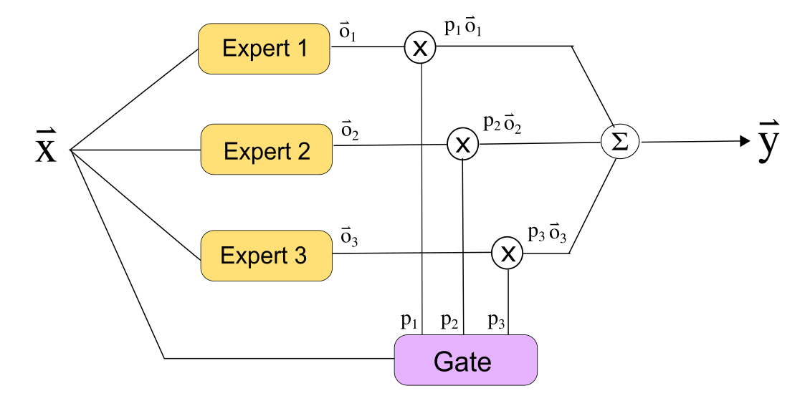

Gated Modular Deep Learning
=======================================================================================================

This repository contains implementations of different Mixture of Experts (MoE) models both existing and novel architectures and methods of training. MoE is a gated modular deep neural network architecture, shown in Figure 1. It consists of simple individual neural network modules called experts and another simple neural network called gate. The gate allocates samples to the experts during training and selects the expert specifialized for a sample during inference. The output of the MoE is some combination of the outputs of the individual experts. The experts and gate are usually trained end-to-end. Since ideally experts specialise in samples, during inference, for each sample only a few experts need to be evaluated and updated. This is called <em> conditional computation</em>.

   

  

*Figure 1 Original MoE architecture with 3 experts and 1 gate. The output of the model is the expected sum of the outputs of the individual experts*

The goal of the various MoE models is to search for good and clean task decompositions among the experts. Good task decompositions enable interpertability and transferability in gated modular neural networks.

Requirements
------------

1. ``Python 3.9`` 
2. ``Pytorch 1.10.1, optionally with Cuda 11.2`` 
3. Linux Operating System. It has been tested on Ubuntu and MacOS. 
4. Additional modules listed in ``requirements.txt``

Installation 
------------

In order to install the code locally please follow the steps below:

1. Clone this repository and go to the cloned directory.

2. Set the environment variable to point to your python executable:

   `export PYTHON=<path to python 3.9 executable>`

3. Run the following command to set up the environment:

   `make -f Makefile.venv` on **Linux/Mac using venv**
   
   or
   
   `make -f Makefile.conda` on **Linux/Mac using conda**

4. Activate the environment by running:

   `source mnn/bin/activate` on **Linux/Mac**

Running experiments
-------------------

1. Scripts to run MNIST experiments are in scripts/MNIST folder

2. Scripts to run CIFAR-10 experiments are in scripts/CIFAR-10 folder

NOTE: Scripts use slurm to schedule jobs on cluster. Modify them accordingly to run on local machines.

Running Jupyter Notebook to collect results 
------------------------

1. Run the following script to start jupyter: 

   `./bin/run_notebooks.sh`

2. In the jupyter lab go to the notebooks folder which contains notebooks to collect results from models

Setting up Wide ResNet
----------------------

To run gate sample similarity experiments for CIFAR-10 you will need Wide Resnet. Follow the instructions [HERE](https://github.com/xternalz/WideResNet-pytorch) to set it up and train a model with CIFAR-10 dataset.